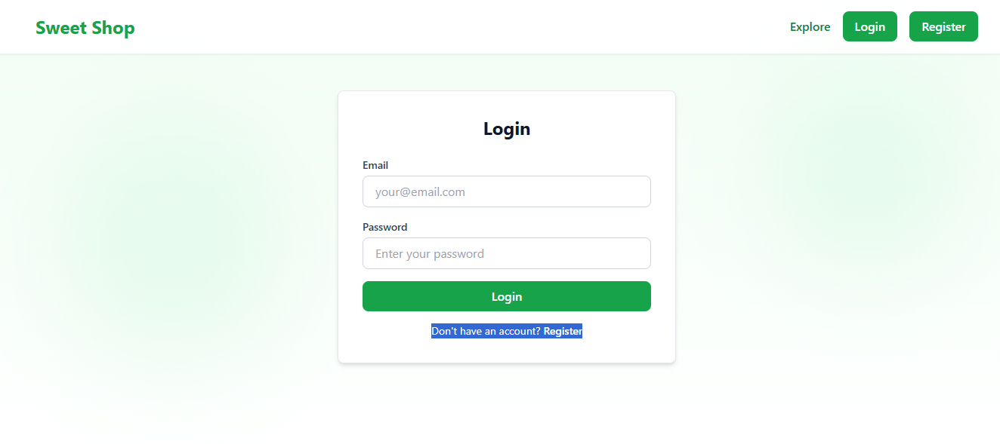
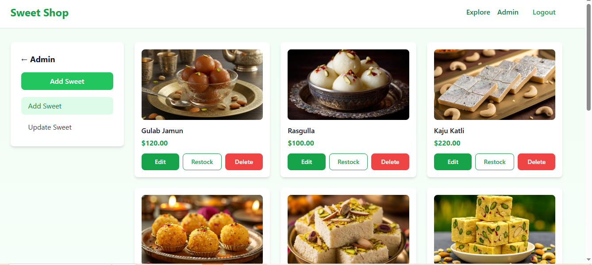

# 🍬 Sweet Shop Management System (TDD Kata)

A full-stack **Sweet Shop Management System** built using **Test-Driven Development (TDD)** principles.  
This project demonstrates backend API design, authentication, database integration, frontend SPA development, automated testing, clean coding practices, and **responsible AI-assisted development**.

---

## 🌐 Live Links

- **Frontend (Live Application):**  
  (https://sweet-shop-management-system-gff3.vercel.app/)

- **Backend (Live API):**  
  https://sweet-shop-backend-fzg2.onrender.com

---

## 🖥 Screenshots







## 📌 Project Overview

The Sweet Shop Management System allows users to browse, search, and purchase sweets, while administrators manage inventory and products securely.

The application follows a **production-ready architecture** with a strong focus on scalability, maintainability, and testability, closely reflecting real-world engineering practices.

---

## 🛠 Tech Stack

### Backend
- **Node.js + Express (TypeScript)**
- **MongoDB** (Mongoose ODM)
- **JWT Authentication**
- **Jest + Supertest** (TDD)
- **bcrypt** (Password hashing)

### Frontend
- **React**
- **Axios**
- **React Router**
- **Figma AI–assisted UI/UX**

### Tooling
- Git & GitHub
- Cursor IDE
- Postman
- ESLint & Prettier

---

## 🔐 Features

### Authentication & Authorization
- User registration & login
- JWT-based authentication
- Role-based access control (User / Admin)

### Sweets Management
- Add sweets (Admin only)
- View all sweets
- Search sweets by:
  - Name
  - Category
  - Price range
- Update sweet details (Admin only)
- Delete sweets (Admin only)

### Inventory Management
- Purchase sweets (quantity decreases)
- Restock sweets (Admin only)
- Purchase disabled when stock is zero

---

## 📂 API Endpoints

### Auth
| Method | Endpoint | Description |
|------|---------|-------------|
| POST | `/api/auth/register` | Register user |
| POST | `/api/auth/login` | Login user |

### Sweets (Protected)
| Method | Endpoint | Description |
|------|---------|-------------|
| POST | `/api/sweets` | Add sweet (Admin) |
| GET | `/api/sweets` | List sweets |
| GET | `/api/sweets/search` | Search sweets |
| PUT | `/api/sweets/:id` | Update sweet |
| DELETE | `/api/sweets/:id` | Delete sweet (Admin) |

### Inventory (Protected)
| Method | Endpoint | Description |
|------|---------|-------------|
| POST | `/api/sweets/:id/purchase` | Purchase sweet |
| POST | `/api/sweets/:id/restock` | Restock sweet (Admin) |

---

## 🧪 Test-Driven Development (TDD)

This project strictly follows **Red → Green → Refactor** methodology.

### Covered Scenarios
- User registration & login
- JWT authentication & authorization
- Admin-only access validation
- CRUD operations on sweets
- Purchase & restock logic
- Edge cases (out of stock, invalid inputs, unauthorized access)

## 🤖 AI Usage (Critical Disclosure)

AI tools were used transparently and responsibly throughout the development of this project to enhance productivity, code quality, and design efficiency.

### How AI Was Used

#### Project Architecture & Structure
AI was used to help design the overall backend and frontend architecture, including folder structure, service layering, and API organization following clean architecture principles.

#### Model Design (User & Sweets)
AI assisted in creating the initial data models for users and sweets, including authentication fields, roles, and inventory attributes. All schemas were manually reviewed and refined.

#### Test Creation (TDD)
ChatGPT was used to generate initial unit and integration test cases before implementation, helping define expected behavior and edge cases as part of the Test-Driven Development workflow.

#### Debugging & Test Failures
Cursor IDE was used to analyze and resolve failing tests during Red → Green cycles, improving logic correctness and overall code readability.

#### UI/UX Design Using AI
GPT-generated prompts were used with Figma AI to design UI layouts, component hierarchy, and color themes, which were then manually implemented in the frontend.

All final architectural decisions, business logic, validations, and implementations were reviewed, modified, and owned by the developer. AI was used strictly as an assistive tool and not as a replacement for engineering judgment.


### Run Tests
```bash
cd backend
npm test
